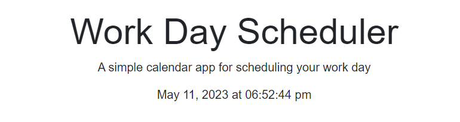
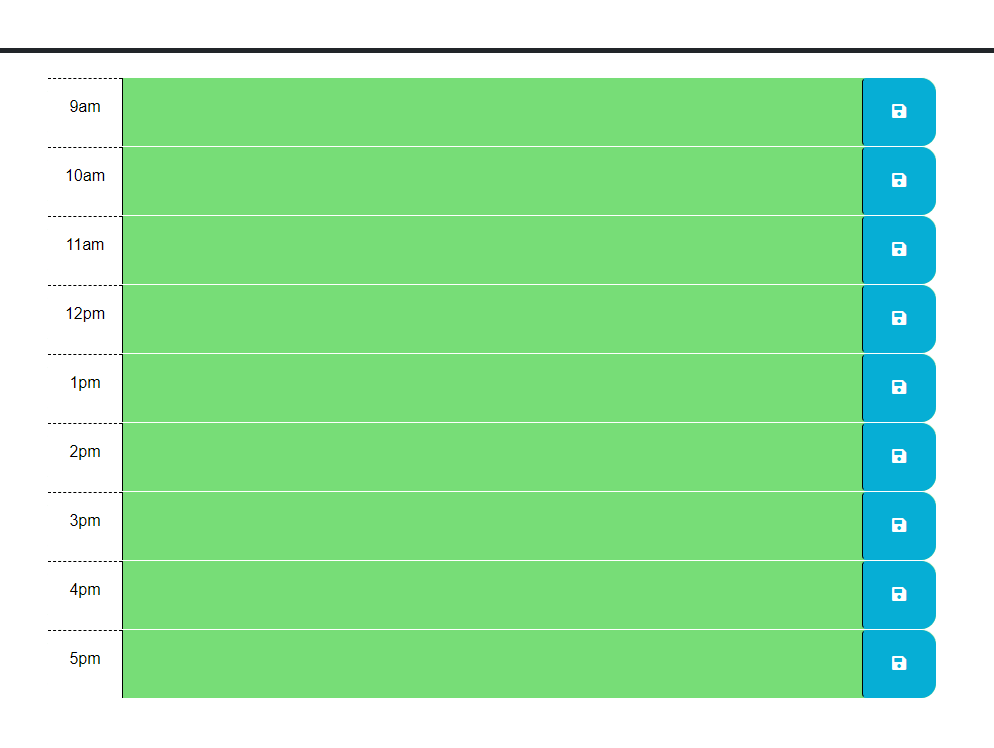
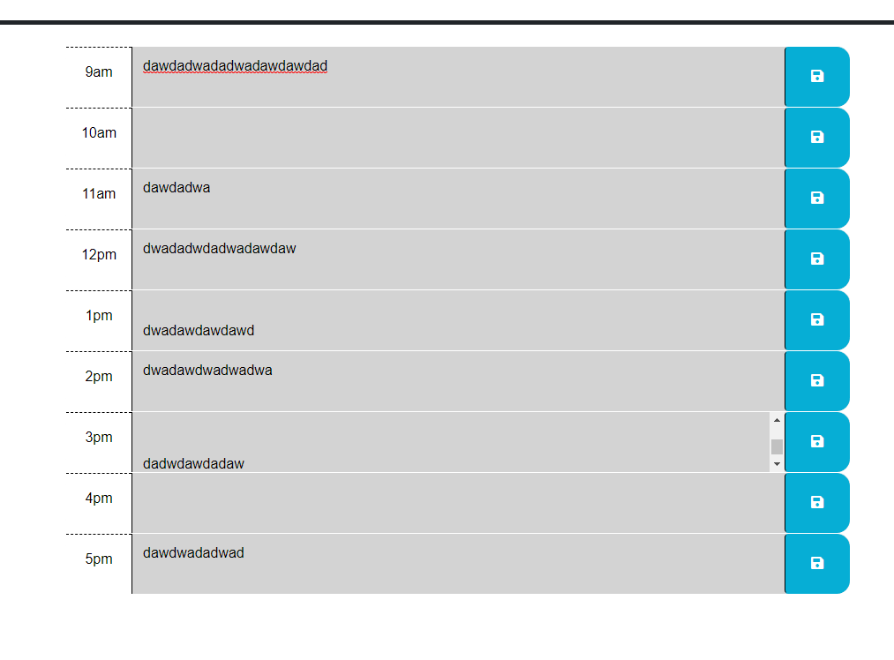
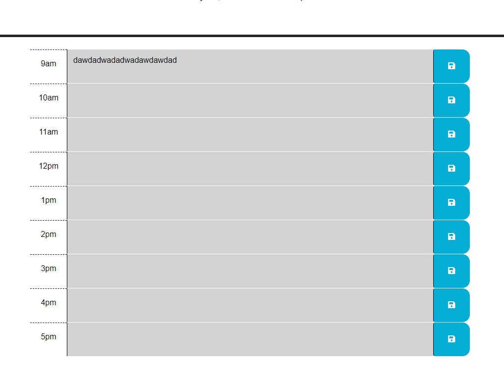
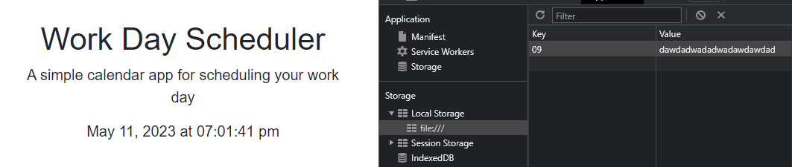

# DailyPlanner

## Description

My motivation for this challenge was to see how far my javascript knowledge has come  with the additions of third party api's.  As a class we have just recently learned about the many third party api's that exist within javascript, some of them being jQuery, bootstrap, and days.  With this new knowledge that was brought to my attention, not by choice i was curious as to how i can code with these third party api's, which is why within this challenge i decided to try and make it work mainly using the javascript portion of my program.  the reason i built this program was to have a clear and easy way to plan out my day, or someone else's if they decided to use it as well.  It helps keep me organised which I'm not very great at in the first place, so a code like this really benefits me and helps me stay on track with what needs to be done.  The problems my code solves is fixing my absolutely atrocious organisation methods, and making it so I stay on track.  The things I learned during this challenge was the full use of local storage and how to use it efficiently. I also learned how the backticks work fully now as well and how easy they can make my coding life.  Last thing i learned is that the linking portion can be really annoying, i know how that may sound but i did have to complete reset my whole code directory due to the fact that my files may have corrupted or something along those lines, to be honest i don't truly know what happened but as soon as i made a new directory it fixed.  

## Installations

N/A

## Usage

## Credits

N/A

## License

MIT License

Copyright (c) [2023] [Albi Krasniqi]

Permission is hereby granted, free of charge, to any person obtaining a copy
of this software and associated documentation files (the "Software"), to deal
in the Software without restriction, including without limitation the rights
to use, copy, modify, merge, publish, distribute, sublicense, and/or sell
copies of the Software, and to permit persons to whom the Software is
furnished to do so, subject to the following conditions:

The above copyright notice and this permission notice shall be included in all
copies or substantial portions of the Software.

THE SOFTWARE IS PROVIDED "AS IS", WITHOUT WARRANTY OF ANY KIND, EXPRESS OR
IMPLIED, INCLUDING BUT NOT LIMITED TO THE WARRANTIES OF MERCHANTABILITY,
FITNESS FOR A PARTICULAR PURPOSE AND NONINFRINGEMENT. IN NO EVENT SHALL THE
AUTHORS OR COPYRIGHT HOLDERS BE LIABLE FOR ANY CLAIM, DAMAGES OR OTHER
LIABILITY, WHETHER IN AN ACTION OF CONTRACT, TORT OR OTHERWISE, ARISING FROM,
OUT OF OR IN CONNECTION WITH THE SOFTWARE OR THE USE OR OTHER DEALINGS IN THE
SOFTWARE.

## Links

Github:
Deployed Application:

## Screenshot Of Deployed Application

